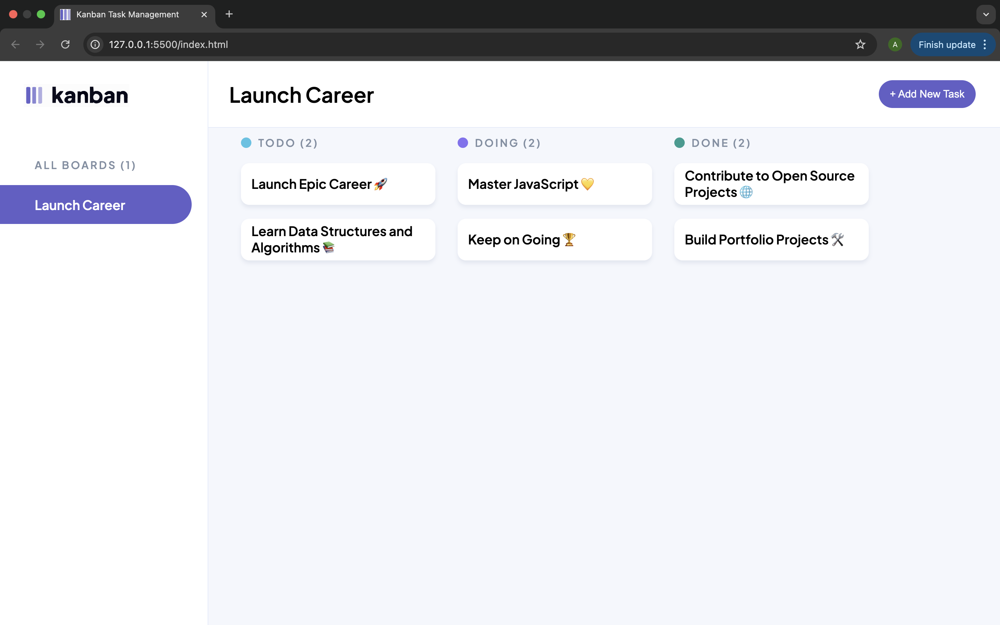
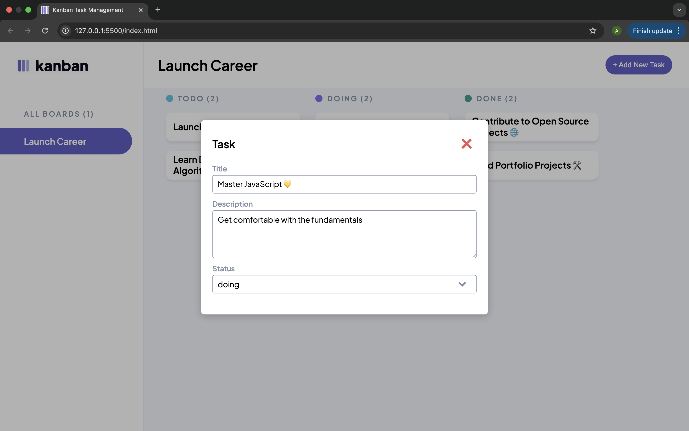
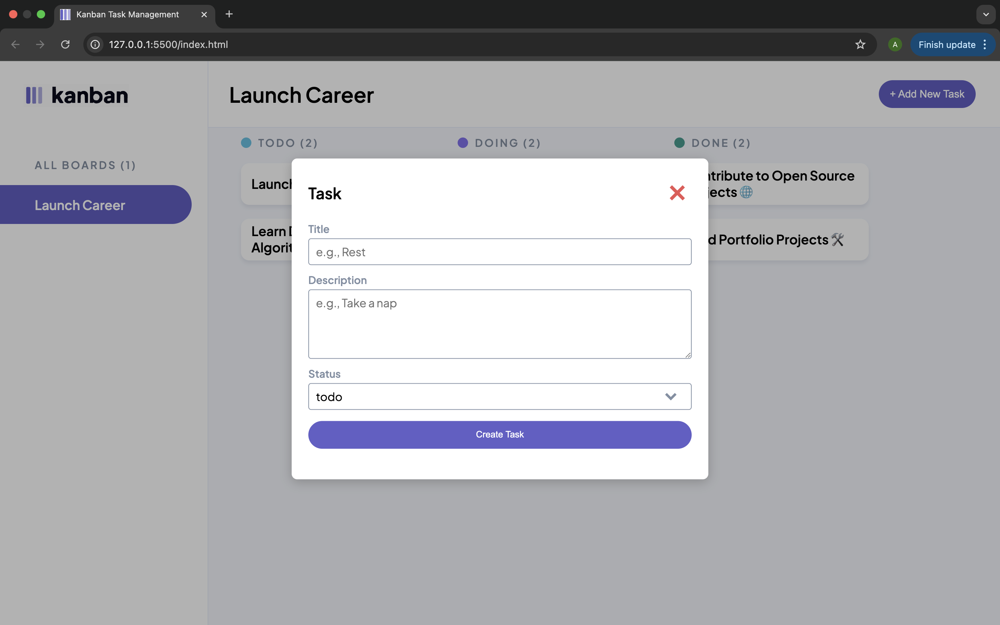
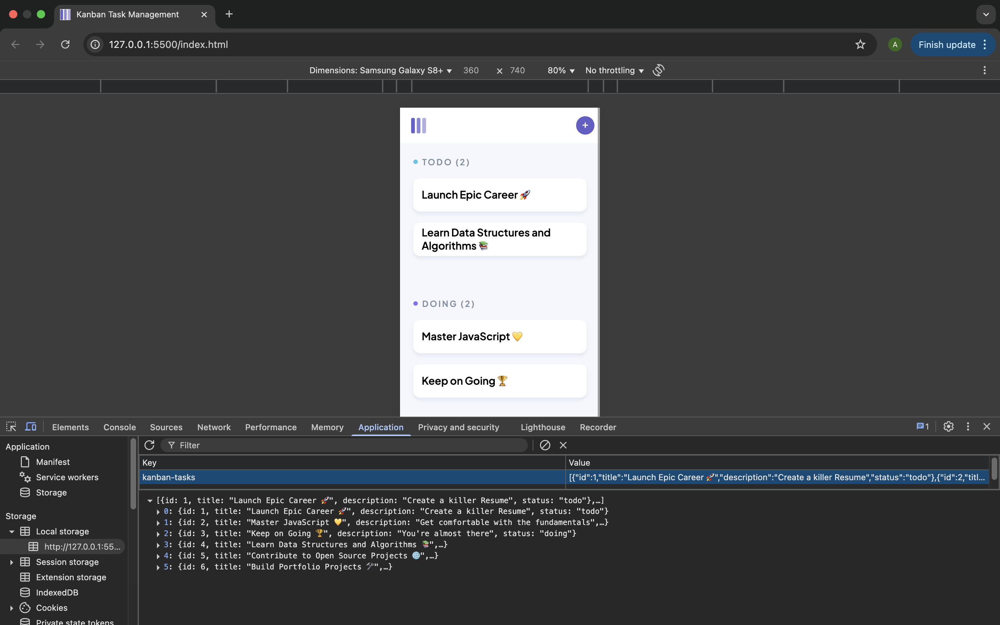

# Kanban Task Management

A lightweight Kanban board built with HTML, CSS, and Vanilla JavaScript.
It allows you to view, add, and track tasks in TODO, DOING, and DONE columns — with task data saved in localStorage so progress persists after refreshing the page.

## 🚀 Features

-  View Tasks – Tasks are grouped into TODO, DOING, and DONE columns.

- Add New Tasks – Use the + Add New Task button to open a modal and create tasks.

- View Task Details – Click on a task card to open a modal showing its title, description, and status.

- Local Storage Support – Tasks are saved in localStorage so they don’t reset when the page is refreshed.

- Dynamic Counters – Each column shows a live task count (TODO (3), DOING (1), etc.).

## 🛠️ Tech Stack

- HTML5 → Page structure and modal dialog.

- CSS3 → Styling for layout, tasks, and modal.

- Vanilla JavaScript (ES6) → Rendering, task management, localStorage, and modal behavior.

## 📁 Folder Structure

project-root/
├── index.html       # Main HTML file  
├── styles.css       # Styling for the board and modal  
├── script.js        # JavaScript logic for tasks and modal  
├── assets/          # Logos, icons, and favicons  
├── images/          # Screenshots for documentation  
└── README.md        # Project documentation  

## Figma Design

Check the updated Figma design for reference: [Figma Link](https://www.figma.com/design/y7bFCUYL5ZHfPeojACBXg2/Challenges-%7C-JSL?node-id=6033-10647&t=sFVwb6fEmRK8u8El-0)

## 🧪 How to Run

1. Clone or download the repository.
2. Open `index.html` in your browser.
3. The task board will render dynamically from the initial task data.
4. Click any task to open the modal and edit details.
5. Check browser Developer Tools → Console for debugging

## 📸 Screenshots
###### Example of modal view on a desktop

###### Example of view task modal

###### Example of create task modal

###### Example of tasks stored in local storage with mobile

## 🧑‍💻 Author

Created by _Ayabonga Mtsotso_

---
